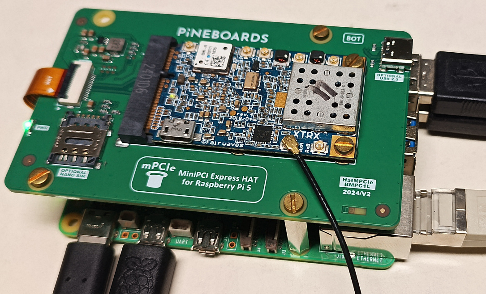

# Fairwaves (legacy) XTRX board on Raspberry Pi 5

## GNU/Linux binary distribution

The Raspberry Pi 5 is running a binary distribution of Debian GNU/Linux on Raspberry
Pi 5 as found at https://www.raspberrypi.com/software/operating-systems/#raspberry-pi-os-64-bit
(Raspberry Pi OS Lite, Release date: November 19th 2024 based on Debian version: 12 (bookworm)
and a kernel 6.6 -- ``Linux raspberrypi 6.6.74+rpt-rpi-2712 #1 SMP PREEMPT Debian 1:6.6.74-1+rpt1 (2025-01-27) aarch64 GNU/Linux``) but using the ``kernel8.img`` kernel rather than the default 
(see the ``config.txt`` line stating ``kernel=kernel8.img``) to use 4 KB memory pagesize rather 
than the defaut 16 KB on RPi5.

The XTRX is fitted on the PCI bus using https://pineboards.io/products/hat-mpcie-for-raspberry-pi-5.



Make sure that 
```
$ lspci
0000:00:00.0 PCI bridge: Broadcom Inc. and subsidiaries BCM2712 PCIe Bridge (rev 21)
0000:01:00.0 Memory controller: Xilinx Corporation Device 7012
0001:00:00.0 PCI bridge: Broadcom Inc. and subsidiaries BCM2712 PCIe Bridge (rev 21)
0001:01:00.0 Ethernet controller: Raspberry Pi Ltd RP1 PCIe 2.0 South Bridge
```
i.e. the XTRX is visible with the ``Xilinx Corporation Device 7012``. In case this entry
is not visible, either check the XTRX connection, or reboot (seems that the board is not always
detected on the PCI bus).

## XTRX driver

In the [XTRX driver](https://github.com/xtrx-sdr/xtrx_linux_pcie_drv), 
comment the ``#ifdef ...`` statement to set ``#define VA_DMA_ADDR_FIXUP`` (around line 180)
```
-#ifdef CONFIG_CPU_RK3399
+//#ifdef CONFIG_CPU_RK3399
 #define VA_DMA_ADDR_FIXUP
-#endif
```
and replace
```
pbufs[i].virt = dma_alloc_coherent(&d->pdev->dev, buflen, &pbufs[i].phys, GFP_KERNEL);
```
with
```
pbufs[i].virt = dmam_alloc_coherent(&d->pdev->dev, buflen, &pbufs[i].phys, GFP_KERNEL);
```
(notice the ``dmam`` instead of ``dma``). This procedure is automated with
```
git clone https://github.com/xtrx-sdr/xtrx_linux_pcie_drv
cd xtrx_linux_pcie_drv
git checkout d218d3e8be3f723000bdfff6b6235a85f7b10e42
patch -p1 < ../xtrx.patch
```

After compiling this modified kernel and loading to memory from the ``xtrx_linux_pcie_drv`` 
directory
```
make
sudo insmod xtrx.ko
sudo dmesg
```
(be aware that ``rmmod xtrx`` with kernel panic) leads to 
```
...
[  108.790866] xtrx: buf[31]=2b08000 [virt 00000000a5952f9b] => 02b087ff
[  108.790985] xtrx: Port config: 0 (1)
[  108.790987] xtrx: Port request: 0
[  108.790990] 0000:01:00.0: ttyXTRX0 at MMIO 0x0 (irq = 0, base_baud = 9600) is a xtrx_uart
[  108.791110] xtrx: Port config: 1 (1)
[  108.791112] xtrx: Port request: 1
[  108.791113] 0000:01:00.0: ttyXTRX1 at MMIO 0x0 (irq = 0, base_baud = 9600) is a xtrx_uart
[  108.791116] xtrx: SIM mctrl=0
```
and indeed ``ls -l /dev/xtrx*`` must display one entry.

## Testing with GNU Radio

The Osmocom source requires the argument ``args="xtrx,dev=/dev/xtrx0"`` to run with the XTRX.

Executing the resulting Python script leads to:
```
./testxtrx.py 
gr-osmosdr 0.2.0.0 (0.2.0) gnuradio 3.10.11.0
built-in source types: file fcd rtl rtl_tcp uhd miri hackrf bladerf rfspace airspy airspyhf soapy redpitaya freesrp xtrx 
xtrx,dev=/dev/xtrx0
xtrx_source_c: XTRX device: %s/dev/xtrx0xtrx_obj::xtrx_obj = 4
06:42:27.883905 INFO:   [XTRX] xtrx_open(): dev[0]='/dev/xtrx0'
06:42:27.883937 INFO:   [ DEF] Probing 'libxtrxll_pcie.so.0' low-level library
06:42:27.886356 INFO:   [ DEF] Probing 'libxtrxll_libusb3380.so.0' low-level library
...
06:42:28.189733 INFO:   [BPCI] PCI:/dev/xtrx0: RX DMA 16 bit SISO (BLK:16384 TS:262144); TX DMA SKIP MIMO @0.0
06:42:28.189769 INFO:   [CTRL] PCI:/dev/xtrx0: Placing TC @262144 on 0 data: 0 stat:20
06:42:28.189853 INFO:   [LMSF] PCI:/dev/xtrx0: NCO ch=3 type=3 freq=0
Press Enter to quit: Using generic for xtrxdsp_iq16_sc32
```
and playing on a PC the resulting audio file sounds functional (``mplayer xtrx.wav``).
